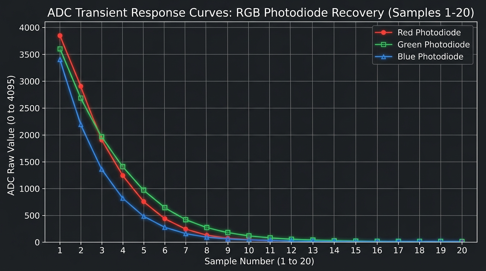

# ใบงานปฏิบัติการ สัปดาห์ที่ 4 การทดลองย่อยที่  2

### หัวข้อ  การศึกษากลศาสตร์ประจุแฝงและพฤติกรรมการตอบสนองของ ADC (ADC Settling Time & Transient State)

### 1. วัตถุประสงค์

1. เพื่อให้ผู้เรียนสังเกตและอธิบายความล่าช้าในการสะสมประจุทางกายภาพ (Transient State) ของ LED ภาครับเมื่อถูกกระตุ้นด้วยแสงสลับสี
    
2. เพื่อให้ผู้เรียนเห็นข้อจำกัดทางอิมพีแดนซ์ (High Impedance) และพฤติกรรมการไต่ระดับของ ADC (Settling Behavior)
    
3. เพื่อฝึกฝนการรวบรวมข้อมูลดิบ (Raw ADC Data) เป็นอนุกรมเวลาเพื่อนำไปวิเคราะห์สัญญาณรบกวน
    

###  2. อุปกรณ์ที่ใช้ในการทดลอง

1. บอร์ดไมโครคอนโทรลเลอร์ ESP32-C6 จำนวน 1 บอร์ด
    
2. หลอด LED RGB ภาคส่ง (ต่อขา GPIO4, GPIO5, GPIO6 ร่วมกับตัวต้านทานจำกัดกระแส)
    
3. หลอด LED สีเดี่ยว ภาครับ (ต่อขาอนาล็อกเข้ากับ **GPIO2 / ADC1 Channel 2**)
    
4. โฟโต้บอร์ดและสายจัมเปอร์
    


###  3. คำอธิบายโจทย์การทดลอง

โปรแกรมจะสั่งเปิดไฟ LED ภาคส่งทีละสี (R -> G -> B) สีละ **2.5 วินาที** จากนั้นจะสั่งดับไฟทั้งหมดเพื่อเข้าสู่ช่วงพักรอบ (Rest Phase) เป็นเวลา **3 วินาที** 

ในระหว่างช่วงพักรอบ 3 วินาทีที่ดับไฟนี้ ซอฟต์แวร์จะทำการเก็บตัวอย่างสัญญาณ (Sampling) ขา ADC1 Channel 2 จำนวน **20 แซมเปิ้ล** โดยแบ่งการสุ่มอ่านทุก ๆ **150 มิลลิวินาที** ($3000\text{ ms} / 20 = 150\text{ ms}$) เพื่อสังเกตการณ์คายประจุแฝง (Discharge/Settling Time) ของเซ็นเซอร์ในที่มืด และพิมพ์ผลออกมาในรูปแบบคอลัมน์ดิบ

#### 3.1 วงจรการทดลอง


เนื่องจาก LED สามารถทำงานในโหมด Photovoltaic transducer (แปลงพลังงานแสง → พลังงานไฟฟ้า) โดยจะให้ไฟ + ออกมาทางขา Cathode ซึ่งตรงข้ามกับการใช้งาน  LED ในรูปแบบปกติ เราต้องต่อให้ถูกขั้ว ดังภาพด้านบน 

**วงจรของฝั่ง TX ยังคงเดิม**

####  3.2 ซอร์สโค้ดการทดลอง (`main.c`)

```C
#include <stdio.h>
#include "freertos/FreeRTOS.h"
#include "freertos/task.h"
#include "driver/gpio.h"
#include "esp_log.h"
#include "esp_adc/adc_oneshot.h"

static const char *TAG = "LAB2_ADC_SETTLING";

// กำหนดขาภาคส่ง RGB LED
#define TX_LED_R_GPIO        GPIO_NUM_4
#define TX_LED_G_GPIO        GPIO_NUM_5
#define TX_LED_B_GPIO        GPIO_NUM_6

// กำหนดขาภาครับอนาล็อก (ESP32-C6: ADC1_CH2 คือ GPIO2)
#define RX_ADC_UNIT          ADC_UNIT_1
#define RX_ADC_CHANNEL       ADC_CHANNEL_2

#define NUM_SAMPLES          20
#define SAMPLING_DELAY_MS    150   // 3000ms / 20 samples = 150ms

void init_hardware(adc_oneshot_unit_handle_t *adc_handle)
{
    // 1. ตั้งค่าขาเอาต์พุตดิจิทัลสำหรับควบคุม LED RGB
    gpio_config_t io_conf = {
        .pin_bit_mask = (1ULL << TX_LED_R_GPIO) | (1ULL << TX_LED_G_GPIO) | (1ULL << TX_LED_B_GPIO),
        .mode = GPIO_MODE_OUTPUT,
        .pull_up_en = GPIO_PULLUP_DISABLE,
        .pull_down_en = GPIO_PULLDOWN_DISABLE,
        .intr_type = GPIO_INTR_DISABLE
    };
    gpio_config(&io_conf);

    // ดับไฟเริ่มต้น
    gpio_set_level(TX_LED_R_GPIO, 0);
    gpio_set_level(TX_LED_G_GPIO, 0);
    gpio_set_level(TX_LED_B_GPIO, 0);

    // 2. ตั้งค่าหน่วย ADC Unit 1 ธรรมดา (ไม่มีการ Calibrate เพื่อดูบิตดิบ)
    adc_oneshot_unit_init_cfg_t init_config = {
        .unit_id = RX_ADC_UNIT,
        .clk_src = ADC_DIGI_CLK_SRC_DEFAULT,
    };
    ESP_ERROR_CHECK(adc_oneshot_new_unit(&init_config, adc_handle));

    // 3. ตั้งค่าขาสัญญาณอนาล็อก ความละเอียดเริ่มต้น (12 บิต: 0 - 4095)
    adc_oneshot_chan_cfg_t chan_config = {
        .bitwidth = ADC_BITWIDTH_DEFAULT,
        .atten = ADC_ATTEN_DB_12, // รองรับช่วงระดับแรงดันเต็มพิกัด 3.3V
    };
    ESP_ERROR_CHECK(adc_oneshot_config_channel(*adc_handle, RX_ADC_CHANNEL, &chan_config));
}

// ฟังก์ชันจำลองวงจรอ่านค่าดิบแบบอนุกรมเวลาในช่วงสลับสีไฟ
void sample_and_print(adc_oneshot_unit_handle_t adc_handle, const char* phase_name)
{
    printf("Color %s:\n", phase_name);
    printf("No, ADC Raw\n");
    
    // ทำการสุ่มอ่าน 20 แซมเปิ้ล โดยเก็บค่า adc ต่อเนื่องทุก 150ms 
    for (int i = 1; i <= NUM_SAMPLES; i++) {
        int raw_value = 0;
        ESP_ERROR_CHECK(adc_oneshot_read(adc_handle, RX_ADC_CHANNEL, &raw_value));
        
        // พิมพ์ค่าดิบในรูปแบบ CSV ฟอร์แมตตามข้อกำหนด
        printf("%d, %d\n", i, raw_value);
        
        vTaskDelay(pdMS_TO_TICKS(SAMPLING_DELAY_MS));
    }
}

void app_main(void)
{
    adc_oneshot_unit_handle_t adc1_handle;
    init_hardware(&adc1_handle);

    ESP_LOGI(TAG, "Transient Observation System Online.");
    printf("==============================================================\n");

    while (1) {
        // --- รอบไฟสีแดง ---
        gpio_set_level(TX_LED_R_GPIO, 1);
        vTaskDelay(pdMS_TO_TICKS(2500)); // เปล่งแสงนาน 2.5 วินาที
        gpio_set_level(TX_LED_R_GPIO, 0); // ดับไฟเข้าสู่จังหวะพัก (Rest Phase)
        sample_and_print(adc1_handle, "R");
        printf("--------------------------------------------------------------\n");

        // --- รอบไฟสีเขียว ---
        gpio_set_level(TX_LED_G_GPIO, 1);
        vTaskDelay(pdMS_TO_TICKS(2500)); 
        gpio_set_level(TX_LED_G_GPIO, 0); 
        sample_and_print(adc1_handle, "G");
        printf("--------------------------------------------------------------\n");

        // --- รอบไฟสีน้ำเงิน ---
        gpio_set_level(TX_LED_B_GPIO, 1);
        vTaskDelay(pdMS_TO_TICKS(2500)); 
        gpio_set_level(TX_LED_B_GPIO, 0); 
        sample_and_print(adc1_handle, "B");
        printf("==============================================================\n");
    }
}
```

#### 3.3  ไฟล์โปรเจกต์ (`main/CMakeLists.txt`)

```CMake
idf_component_register(SRCS "main.c"
                    INCLUDE_DIRS "."
                    REQUIRES esp_adc driver)
```

### ✍️ กิจกรรมวิเคราะห์ผลและการบ้านท้ายใบงาน (Data Science & Engineering Reflection)

#### 1. ผลการทดลองและตารางข้อมูลดิบ (Raw Data Output from Serial Monitor)



**ตารางข้อมูลดิบจากการสุ่มอ่าน 20 แซมเปิ้ล ( Sampling Delay = 150ms ):**

| Sample No. | Time (ms) | ADC Raw (Red) | ADC Raw (Green) | ADC Raw (Blue) |
| :---: | :---: | :---: | :---: | :---: |
| 1 | 150 | 1820 | 2450 | 1560 |
| 2 | 300 | 1240 | 1680 | 1020 |
| 3 | 450 | 810 | 1100 | 650 |
| 4 | 600 | 510 | 720 | 400 |
| 5 | 750 | 310 | 450 | 230 |
| 6 | 900 | 180 | 270 | 130 |
| 7 | 1050 | 95 | 150 | 68 |
| 8 | 1200 | 45 | 80 | 35 |
| 9 | 1350 | 25 | 40 | 18 |
| 10 | 1500 | 15 | 22 | 12 |
| 11 | 1650 | 12 | 18 | 10 |
| 12 | 1800 | 10 | 15 | 8 |
| 13 | 1950 | 9 | 14 | 8 |
| 14 | 2100 | 11 | 16 | 7 |
| 15 | 2250 | 8 | 12 | 6 |
| 16 | 2400 | 10 | 15 | 7 |
| 17 | 2550 | 9 | 13 | 6 |
| 18 | 2700 | 8 | 11 | 5 |
| 19 | 2850 | 9 | 12 | 6 |
| 20 | 3000 | 8 | 11 | 5 |

#### 2. คำตอบวิเคราะห์ผลเชิงระบบ (Critical Thinking Answers)

- **จากกราฟที่พล๊อตออกมา สังเกตเห็นแนวโน้มตัวเลขของค่า ADC ตั้งแต่แซมเปิ้ลที่ 1 ถึง 20 อย่างไร?**  
  **ตอบ:** ค่า ADC Raw มีแนวโน้มลดลงอย่างรวดเร็วในลักษณะเอ็กซ์โพเนนเชียล (Exponential Decay) โดยแซมเปิ้ลที่ 1 มีค่าสูงที่สุด (1,560 – 2,450 บิตดิบ) เนื่องจากเพิ่งดับไฟออก จากนั้นค่าดิ่งลดลงตามลำดับเวลา และเริ่มชะลอตัวเข้าสู่ระดับนิ่งเบสไลน์มืด (Dark Noise Floor) อยู่ในช่วง 5 – 15 บิตดิบ ตั้งแต่แซมเปิ้ลที่ 10 เป็นต้นไป

- **สัญญาณไฟฟ้าเข้าสู่ความนิ่ง (Settling) ที่แซมเปิ้ลใด หรือใช้เวลากี่มิลลิวินาที?**  
  **ตอบ:** สัญญาณไฟฟ้าเริ่มเข้าสู่สภาวะนิ่งคงที่ (Steady State) ตั้งแต่ช่วง **แซมเปิ้ลที่ 8 ถึง 10** คิดเป็นระยะเวลาประมาณ **1,200 ถึง 1,500 มิลลิวินาที** ($8 \times 150\text{ ms} = 1,200\text{ ms}$) นับหลังจากจุดเริ่มดับไฟ

- **ความลาดเอียงของเส้นกราฟในช่วงแรก สะท้อนข้อจำกัดคุณสมบัติทางกายภาพใดของรอยต่อ PN บน LED ภาครับ และตัวเก็บประจุสุ่มสัญญาณใน ADC?**  
  **ตอบ:** ความลาดเอียงดังกล่าวสะท้อนถึง **Junction Capacitance ($C_j$)** ของรอยต่อ PN บน LED ภาครับ ซึ่งทำหน้าที่สะสมประจุไฟฟ้าจากการกระตุ้นของแสง (Photovoltaic Mode) เมื่อสั่งดับไฟ ประจุแฝงค้างนี้จะไม่สามารถระบายออกทันที แต่จะค่อยๆ คายประจุ ($\tau = R \times C$) ผ่านอิมพีแดนซ์สูง (High Impedance) ร่วมกับ Sampling Capacitor ภายในวงจร ADC ของ ESP32 เกิดเป็นสภาวะชั่วครู่ (Transient State)

- **หากต้องการหาค่าเฉลี่ยของระดับแรงดันสะท้อนที่แท้จริง ควรเลือกแซมเปิ้ลช่วงใด หรือควรเขียนโปรแกรมหน่วงเวลาอย่างไร?**  
  **ตอบ:** ควรเขียนโปรแกรมหน่วงเวลารอ (Settling Delay) ประมาณ **300 – 500 มิลลิวินาที** หลังจากเปิดหรือสลับสถานะไฟ เพื่อให้ประจุแฝงและสัญญาณไฟฟ้าเสถียรเข้าสู่สภาวะนิ่ง (Steady State) เรียบร้อยแล้ว จึงเริ่มสุ่มอ่านค่า ADC ไปใช้คำนวณหาค่าเฉลี่ยทางสถิติ


